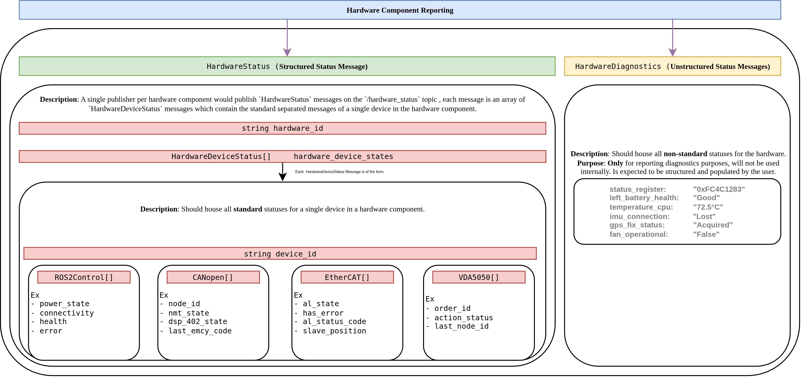

# Standardized Hardware Status Reporting

## Short description

This proposal is an attempt at a standardized way for hardware components in `ros2_control` to report their status.

Right now, if you're writing a hardware component, how you report things like health, errors, or connectivity is pretty much up to you. This usually means everyone rolls their own custom messages. While that works for a single project, it makes it really tough to build generic, reusable tools on top of `ros2_control` (and even internally!). This proposal is a first-pass attempt at defining a generic `HardwareStatus` message. The main goal is to find a good balance between a structured, predictable format that tools can rely on, and the flexibility needed to report all the weird, wonderful, and specific details of different hardware.

This is very much a draft to get the conversation started, not a final solution!

Here's a diagram I put together to visualize it:



Let's discuss this in slightly more detail.

## 0. Note on Terminology
- Hardware Component: A Hardware Interface written for a Single Component, currently can be of form `System`, `Actuator` or `Sensor`, and have multiple sub-components.
    - Ex - "pal_arm"
- Device: A sub-component of a Hardware Component.
    - Ex - "base_motor"

## 1. The Idea: Structured vs. Unstructured

The core idea is to split status reporting into two complementary parts.

1.  **Structured, Standards-Based Status:**
    - A fixed set of fields covering \~80% of common hardware needs - machine-readable, reliable, and directly consumable by controllers, watchdogs, automation tools and even for us internally.
    - A collection of status messages, where each message type corresponds to a specific industry standard (e.g., `CANopenState`), providing a machine-readable and reliable format.
    - A device in a hardware component populates only the status blocks relevant to it within a single, device-specific message(`HardwareDeviceStatus`), aggregates it into one message(`HardwareStatus`) which containes all the devices in the hardware, covering the common hardware needs for controllers, watchdogs, and automation tools.

2.  **Unstructured Status:**
    - A free-form array of key/value diagnostics for everything else-geared toward logs, dashboards, and human inspection only.
    - A slower, richer stream of `diagnostic_msgs/KeyValue[]`, strictly for debugging and UI, ideally not parsed by control loops.

## 2. Example Message Topology

We separate **real-time status** (fast, small) from **detailed diagnostics** (bulkier, slower) on two topics:

| Topic                          | Msg Type                           | Rate     | Intended Use                                |
| ------------------------------ | ---------------------------------- | -------- | ------------------------------------------- |
| `/hardware_status`             | `control_msgs/HardwareStatus`      | 1–50 Hz  | Health, ops & safety logic, auto‐monitoring |
| `/hardware_diagnostics` | `control_msgs/HardwareDiagnostics` | 0.1–1 Hz | GUI dashboards, logs, debugging             |

## 3. Structured Status: `HardwareStatus`

The foundation of this approach is the `HardwareStatus` message. A single publisher per hardware component would publish `HardwareStatus` messages on the `/hardware_status` topic , each message is an array of `HardwareDeviceStatus` messages which contain the standard separated messages of a single device in the hardware component.

```
# control_msgs/msg/HardwareStatus

std_msgs/Header header        # timestamp + frame_id (optional)
string           hardware_id  # unique per‐hardware-component, ideally the name of the hardware derived from HardwareInfo e.g. "pal_arm"

# --- Device Status Aggregation ---------------------------------
# An array containing the status of individual devices in the hardware component
HardwareDeviceStatus[]     hardware_device_states
```
```
# control_msgs/msg/HardwareDeviceStatus
string           device_id  # unique per-device, e.g. "base_motor"

# --- Standard-Specific States --------------------------------------
# States populated based on the standards relevant to this device.
# A device will only fill the arrays for the standards it implements, rest will be empty
GenericState[]     generic_hardware_status
CANopenState[]         canopen_states
EtherCATState[]        ethercat_states
VDA5050State[]         vda5050_states
```

### 3.1. Standardized State Messages

Below are the proposed initial standard-specific messages, based on widely used industrial standards. Additions and opinions here would be really appreciated!

---

**`ros2_control` Generic State**

This message encapsulates the general-purpose status fields, serving as a baseline for any hardware component.

```
# control_msgs/msg/GenericState

# --- Health & Error ----------------------------------------------
uint8  health_status         # see HealthStatus enum
uint8[]  error_domain        # Array of device errors, see ErrorDomain enum

# --- Operational State -------------------------------------------
uint8  operational_mode      # see ModeStatus enum
uint8  power_state           # see PowerState enum
uint8  connectivity_status   # see ConnectivityStatus enum

# --- Vendor & Version Info ----------------------------------------
string manufacturer          # e.g. "Bosch"
string model                 # e.g. "Lidar-XYZ-v2"
string firmware_version      # e.g. "1.2.3"

# --- Optional Details for Context ---------------------------------
# Provides specific quantitative values related to the enums above.
# e.g., for power_state, could have {key: "voltage", value: "24.1"}
# e.g., for connectivity, could have {key: "signal_strength", value: "-55dBm"}
diagnostic_msgs/KeyValue[] state_details
```

#### `ROS2ControlState` Enums
```
# control_msgs/msg/GenericState (enums)

# High-level health
uint8 HEALTH_UNKNOWN=0
uint8 HEALTH_OK     =1
uint8 HEALTH_DEGRADED=2
uint8 HEALTH_WARNING =3
# Hardware stops publishing state when it returns ERROR/FATAL, how are these set/updated?
uint8 HEALTH_ERROR   =4
uint8 HEALTH_FATAL   =5

# Error category
uint8 ERROR_NONE    =0
uint8 ERROR_UNKNOWN =1
uint8 ERROR_HW # generic hardware fault/error
uint8 ERROR_SW # generic software fault/error
uint8 ERROR_OVER_TRAVEL # Hardware stopped motion because position is over limits

# Hardware/Software status
uint8 EMERGENCY_STOP_HW # state of the emergency stop hardware (i.e. e-stop button state)
uint8 EMERGENCY_STOP_SW # state of the emergency stop software system (over travel, pinch point)
uint8 PROTECTIVE_STOP_HW # state of the protective stop hardware (i.e. safety field state)
uint8 PROTECTIVE_STOP_SW # state of the software protective stop
uint8 SAFETY_STOP
unit8 CALIBRATION_REQUIRED


# Mode of operation
uint8 MODE_UNKNOWN    =0
uint8 MODE_MANUAL     =1
uint8 MODE_AUTO       =2 # automatic mode when the driver is remote controlling the hardware
uint8 MODE_SAFE       =3 # what is the expected use case for this mode?
uint8 MODE_MAINTENANCE=4
uint8 MODE_JOG_MANUAL
uint8 MODE_ADMITTANCE
uint8 MODE_MONITORED_STOP
uint8 MODE_HOLD_TO_RUN
unit8 MODE_CARTESIAN_TWIST
unit8 MODE_CARTESIAN_POSE
uint8 MODE_TRAJECTORY_FORWARDING
uint8 MODE_TRAJECTORY_STREAMING

# Power states
uint8 POWER_UNKNOWN   =0
uint8 POWER_OFF       =1
uint8 POWER_STANDBY   =2
uint8 POWER_ON        =3
uint8 POWER_SLEEP     =4
uint8 POWER_ERROR     =5
# Battery power states see [BatteryState.msg](https://docs.ros2.org/foxy/api/sensor_msgs/msg/BatteryState.html)
uint8 POWER_LEVEL_LOW
uint8 POWER_LEVEL_CRITICAL
uint8 POWER_CHARGING
uint8 POWER_CHARGING_ERROR

# Connectivity
uint8 CONNECT_UNKNOWN =0
uint8 CONNECT_UP      =1
uint8 CONNECT_DOWN    =2
uint8 CONNECT_FAILURE =3
uint8 CONNECTION_SLOW # to tell the controlling system it is struggling to communicate at rate
```

---

**CANopen State**

Reports state according to CiA 301 and CiA 402, common for motor drives and I/O.
-   **Source:** [CAN in Automation (CiA)](https://www.can-cia.org/) - CiA 301 & 402 specifications.

```
# control_msgs/msg/CANopenState

uint8  node_id           # The CANopen node ID of the device

# --- CiA 301 State -------------------------------------------------
uint8  nmt_state         # Network Management state (e.g., OPERATIONAL)

# --- CiA 402 State (for drives) ------------------------------------
uint8  dsp_402_state     # Drive state machine state (e.g., OPERATION_ENABLED)

# --- Error Reporting -----------------------------------------------
uint32 last_emcy_code    # Last Emergency (EMCY) error code received
```

---

**EtherCAT State**

Reports the EtherCAT slave state according to the EtherCAT State Machine (ESM).
-   **Source:** [EtherCAT Technology Group (ETG)](https://www.ethercat.org/en/downloads.html) - ETG.1000.4 EtherCAT Protocol Specifications.

```
# control_msgs/msg/EtherCATState

uint16 slave_position    # Position of the slave on the bus (0, 1, 2...)
string vendor_id         # Unique vendor identifier
string product_code      # Unique product code for the device

# --- EtherCAT State Machine (ESM) ----------------------------------
uint8  al_state          # Application Layer state (INIT, PREOP, SAFEOP, OP)
bool   has_error         # True if the slave is in an error state
uint16 al_status_code    # AL Status Code indicating the reason for an error
```

---

**VDA5050 State**

For AGVs and AMRs compliant with VDA5050, this provides a snapshot of the vehicle's high-level status.
-   **Source:** [Verband der Automobilindustrie (VDA)](https://github.com/VDA5050/VDA5050) - VDA 5050 Specification.

```
# control_msgs/msg/VDA5050State

# --- Order and Action Status ---------------------------------------
string order_id          # ID of the currently executed order
string action_status     # e.g., RUNNING, PAUSED, FINISHED, FAILED
uint32 last_node_id      # ID of the last reached node in the topology

# --- Vehicle State -------------------------------------------------
bool   driving           # True if the vehicle's drives are active
float64 battery_charge   # Current battery charge in percent
string operating_mode    # e.g., MANUAL, AUTOMATIC, SERVICE

# --- Error Reporting -----------------------------------------------
string error_type
string error_description
```

## 4. Unstructured Diagnostics: `HardwareDiagnostics`

```
# control_msgs/msg/HardwareDiagnostics

std_msgs/Header    header
string             hardware_id
KeyValue[]         entries   # diagnostic_msgs/KeyValue[]
```

> **Example Entry**
>
> ```yaml
> header:
>   stamp: {sec: 1625563200, nanosec: 0}
> hardware_id: "arm_controller"
> entries:
>   - {key: "cpu_temp",       value: "72.5°C"}
>   - {key: "voltage_input",  value: "24.1V"}
>   - {key: "last_error_code",value: "0x1A3F"}
> ```

## 5. Open Questions & Discussion
1.  Is the current list of standardized state messages (`CANopen`, `EtherCAT`, `VDA5050`, `ISO10218`) a good starting point? Are there other non-proprietary standards that are critical to include?
2.  Is this whole approach overly complicated? It would be good to avoid that pitfall.

## 6. Alternative Publishing Strategies

While this proposal centers on a single topic with an array of device statuses, it's worth discussing the trade-offs of other possible architectures. How else could we structure the flow of status information?

-   **Per Device Messages**
    -   One issue I see with the current aggregated status message approach is that it seems a tad bit complicated for simple systems, what if a hardware component has only 1 actuator?
    -   Then what if, instead of a single aggregated topic, each device in a hardware component published its own `HardwareDeviceStatus` message on the same `/hardware_status` topic which will now be of the type `HardwareDeviceStatus`
    -   Then receivers just listen to the same `/hardware_status` topic as before, but just have to parse the `device_id` to see if the data is relevant, and similarly, publishers have to also only fill in the `HardwareDeviceStatus` message and send it without need of aggregation

## References
Links of hardware interfaces and their attempt to convey hardware status and support other control modes
### UR
[hardware_interface](https://github.com/UniversalRobots/Universal_Robots_ROS2_Driver/blob/868f240bc8578ebfa1d19b94f8a6a1ad62fa0bd1/ur_robot_driver/src/hardware_interface.cpp#L266-L270)
[SafetyMode.msg](https://github.com/UniversalRobots/Universal_Robots_ROS2_Driver/blob/main/ur_dashboard_msgs/msg/SafetyMode.msg)
[RobotMode.msg](https://github.com/UniversalRobots/Universal_Robots_ROS2_Driver/blob/main/ur_dashboard_msgs/msg/RobotMode.msg)
[control.xacro](https://github.com/UniversalRobots/Universal_Robots_ROS2_Description/blob/85d2ad8d1526ee6c0f21dca94e1e697c83706b71/urdf/ur.ros2_control.xacro#L294-L311)
### Kuka
[hardware_interface](https://github.com/lbr-stack/lbr_fri_ros2_stack/blob/f2784b86e5975eddc9b5eab901baaca329306653/lbr_ros2_control/include/lbr_ros2_control/system_interface_type_values.hpp#L8-L27)
### Kinova
[fault_reset controller](https://github.com/Kinovarobotics/ros2_kortex/blob/main/kortex_description/arms/gen3/7dof/config/ros2_controllers.yaml#L17-L18) to report and reset faults.
[twist_controller](https://github.com/Kinovarobotics/ros2_kortex/blob/309f9c9d4a277970e542e5ac1fe260ced0630f65/kortex_description/arms/gen3/7dof/config/ros2_controllers.yaml#L11-L12)
### Dynamixel
[hardware_interface](https://github.com/ROBOTIS-GIT/dynamixel_hardware_interface/blob/02841dd2ae422676e5dc0fea37057bdec3be8cc1/include/dynamixel_hardware_interface/dynamixel_hardware_interface.hpp#L53-L91)
### Robotiq
[hardware_interface](https://github.com/PickNikRobotics/ros2_robotiq_gripper/blob/12e623212e6891a5fcc9af94d67b07e640916394/robotiq_driver/include/robotiq_driver/driver.hpp#L41-L66)
[acrivation_controller](https://github.com/PickNikRobotics/ros2_robotiq_gripper/blob/main/robotiq_controllers/src/robotiq_activation_controller.cpp)
### Ethercat
[hardware_interface](https://github.com/ICube-Robotics/ethercat_driver_ros2/blob/52be2c2ed163bab25d46c402ddb4e7216c0a0ec3/ethercat_generic_plugins/ethercat_generic_cia402_drive/include/ethercat_generic_plugins/cia402_common_defs.hpp#L31-L56)
### ROS2 canopen driver
https://github.com/ros-industrial/ros2_canopen/tree/master
### Picknik Twist & Fault controllers
https://github.com/PickNikRobotics/picknik_controllers