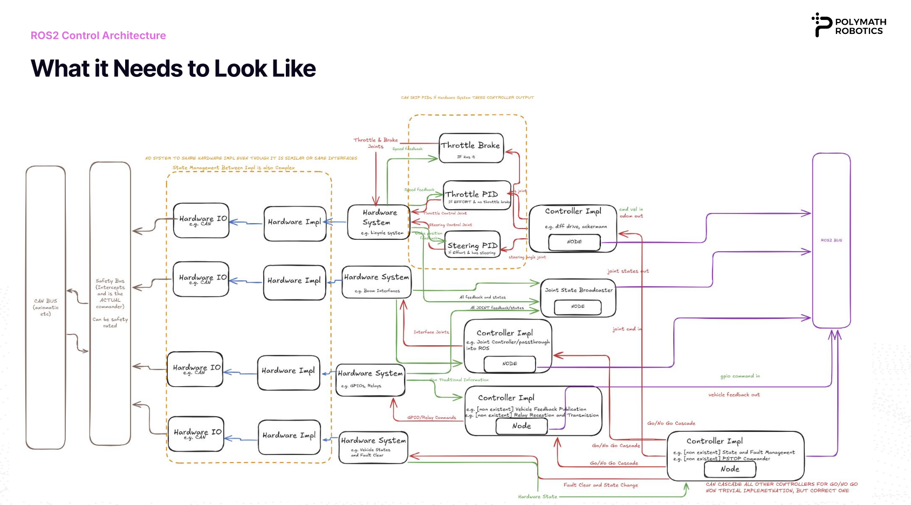
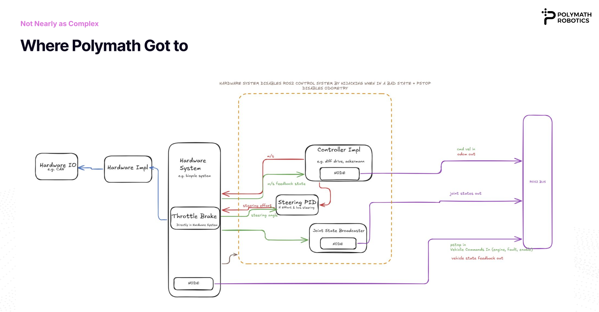
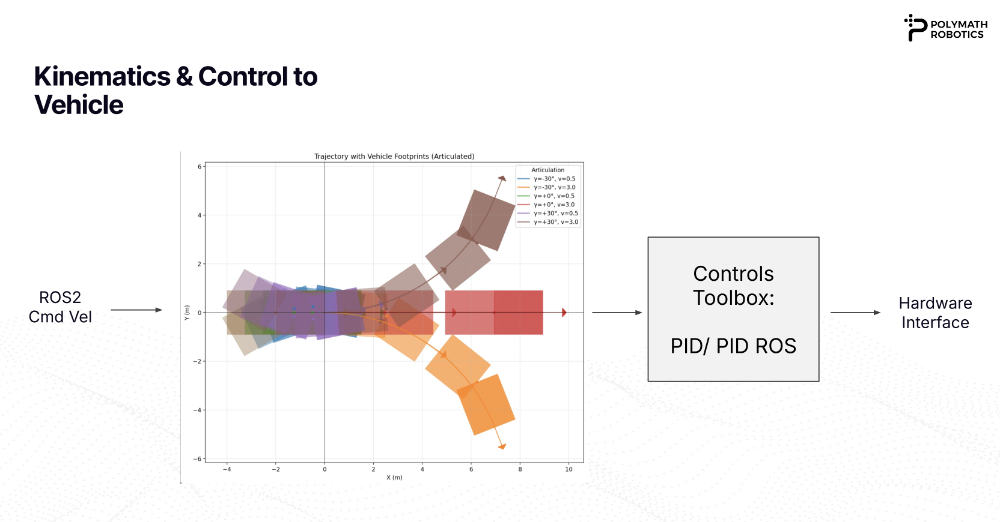

# Apply ROS2 Control in The Field

## Polymath Robotics Use Case

### Summary

This section summarizes a Polymath Robotics presentation from ROS by The Bay. Polymath builds autonomy software for off-highway vehicles — planning, safety, and infrastructure tooling for production-ready systems.

### Requirements

Scalable, production-grade, reliable, testable, and safe. Polymath must support multiple integrators, vehicle types, and applications; some vehicles have unsupported kinematics. Safety needs include protective stop and configurable stopping behaviors.

- Control: throttle, brake, steering, fault reset. 
- Feedback: speed, steering angle, vehicle state. 
- ROS inputs: vehicle state, ODOM, Joint States. ROS outputs: cmd velocity. 
- Protective stop, fault reset. 

Must be teleoperable, multi-kinematics, multi model/make/year, and autonomous-ready.

Fleet context: articulated vehicles/tractors with two rigid bodies connected by a steerable joint. Unlike front-wheel steering, these turn by bending at the central joint. The articulation angle is how many degrees that joint is bent.

### Design Iterations

Polymath Robotics evaluated ros2_control frameworks and ran into several challenges. Mapping diverse vehicles to specific hardware interfaces and incorporating braking and steering logic into various controllers became too complex. Additional factors — kinematics for articulation, the cognitive load of ros2_control configuration, and protective-stop integration — led them to their own design. 

Polymath uses CAN with socketcan as interface. They then parse the CAN messages in a layer that converts them into useful information. That layer then gets read into whoever needs it, such as a hardware system, or directly into the polymath driver structure.

### Kinematics & Control to Vehicle

The pipeline to generate the twist odometry is: **Hardware sensors → kinematics math → ROS2 Odometry/Twist topic**

- Kinematics acts as the translation layer — The articulated vehicle footprint plot shows that a raw cmd_vel (linear + angular velocity) must be turned into the actual steering and drive commands the vehicle needs, based on how far the joint is bent and how fast it's moving. A single velocity command produces very different vehicle footprints(motion trajectories) depending on steering state.

- PID as the control strategy — Rather than a complex model-predictive or learning-based controller, Polymath uses a straightforward PID (or PID-ROS wrapper) for closing the loop. 

### Complexity for Articulation

A diagram from the presentation shows three curves: at a given articulation angle, angular velocity depends strongly on forward speed. This leads to several design implications — for example, accounting for steering rate (γ̇) in the twist estimate to avoid localization drift, and modeling the lag between commanded steering and actual geometry due to rotational inertia at the articulation joint.

This is more complex than a standard differential-drive robot where `ω = v/r`. Here, angular velocity is a **non-linear function of geometry, speed, and the derivative of the steering state** which may be why Polymath built a dedicated kinematics layer rather than relying on a generic ROS2 diff-drive controller.

Note from Polymath:

> Articulation does not align directly with a bicycle steering controller as it has different kinematics and includes an extra term for articulation rate.

## Configuration Challenges

### Scattered config, high cognitive load

Polymath compared ROS2 Control's configuration model with their custom driver approach:

**ROS2 Control:**
- URDF - joint limits
- Controller Config(s) with Mappings to URDF
- What launches where?

**Polymath Driver:**
- Single config surfacing
- Only surface configurations and not joints
- Manual URDF matching

### PStop (Protective Stop)

A protective stop system is designed to be a preventative measure that initiates a controlled shutdown with no immediate danger. This is different from e-stop.

### Benefits from Polymath Driver Approach

- Easier to implement health monitoring and protective stop
- Only two places to manage: C++ source and config file
- Self-contained, independently testable, reusable libraries
- Streamlined odometry and kinematics
- Still able to use open-source tooling
- Easier to customize behavior without modifying existing stacks

### Questions and Opportunities for ros2_control

- Regarding the Polymath design statement: "Safety: the hardware can disable the ROS2 Control System on bad state, and an emergency stop disables odometry output." What does this entail?

Note from Polymath: 

>This refers to when a vehicle is in some sort of non-operational mode. Examples could be emergency stops, faulted states, human only modes which we have to take control from. In all of these, we don't want any controllers to send commands. We ESPECIALLY don't want wind up, even to the limits, because on taking back control it'll max out its command and shoot in some direction.

- Is it true that Polymath uses only the PID from control_toolbox?

Note from Polymath:

>We are using PID and PIDRos. We have used the other parts of the library before as well such as the lowpass filter. 
>For some of our vehicles we are still using ROS 2 Control but are currently transitioning to our internal version currently.But we plan to keep using PID and PID Ros."

- Regarding: "For multi-joint control interfacing with other libraries they will keep using it, but break out the interfaces." Are there examples?

Note from Polymath:

> Yes! We are using MoveIt to control what is effectively a multi-joint crane doing some work in a metal facility. We don't plan to move away from ros2 control and moveit for this application."

- Are there features in ros2_control or ros2_controllers that could reduce complexity (e.g., features under control_toolbox)?

Note from Polymath:

> This is a hard question, some of it is structural. The problem is that to add something like a fault clear we have to add a controller + a hardware interface that does clearing.  For handling a pstop, similar but it needs a controller that outputs zero cmd_vels into the cascade for the kinematic controllers. Ideally we also reset the PID windup to 0 too. And the maintenance of all the specific pieces is a lot.

> We are also on humble so a lot of the controllers don't yet have the ability to cascade.

## Polymath Open Source Projects

**Socketcan Adapter:** https://github.com/polymathrobotics/socketcan_adapter
- Socketcan Encapsulated by C++
- Callbacks on CAN Receive to fit within ROS2 design language

**Sygnal Libraries:** https://github.com/polymathrobotics/sygnal
- Installs DBCs (CAN Definition databases)
- Generate libraries for DBCs
- Encapsulate libraries with clear data management
- Add promise-future relationships for request-response

**polymath_msgs:** https://github.com/polymathrobotics/polymath_msgs
- ROS2 API to the Polymath Stack including Vehicle Feedback types (list of timestamped key value pairs)

**protective_stop:** https://github.com/polymathrobotics/protective-stop
- A system for connecting a node to a remote stop and publishing stop messages into ROS2 depending on health

**polymath_kinematics** *(name pending)*
- Independent library for kinematic estimations, both forward and inverse
- Vehicle-in-mind but also simulation-in-mind (gives additional states useful for Gazebo)
- Lightweight C++ with pybind11 support for Python 3 usage

**dbc_gen_cpp**
- Generating DBC from cantools into C++ objects
- Tooling for cleaner handling
- CMakeLists macros for ease

